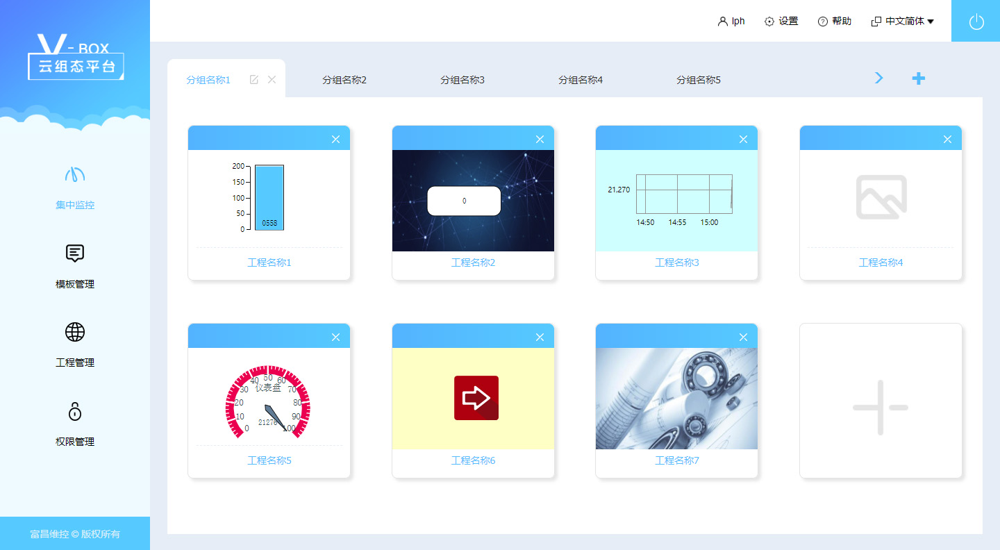

# 集中监控

> 集中监控模块即平台的默认首页,该页可通过切换分组集中监控各分组下用户创建的工程列表。并且可对分组进行添加、删除、修改操作。同时可对每个分组添加工程、移除工程。点击工程名称可浏览具体工程的解析画面。

### 分组管理
1. 切换分组

点击分组名称，可切换至选定的分组。
2. 切换分组
点击分组名称，可切换至选定的分组。
3. 添加分组
点击图标  可添加一个新分组。
4. 编辑分组
点击图标可编辑当前分组名称。
5. 删除分组
点击图标 可删除当前分组。
6. 更多分组
点击图标显示上一页或下一页分组。

### 分配工程
集中监控模块可给每个分组分配工程、移除工程、浏览工程。点击分组名称，将显示为该分组分配的工程列表
1. 添加工程
点击工程列表区域中按钮，可为该分组分配一个工程。
2. 移除工程
点击工程列表中某个工程缩略图右上角的按钮，可将该工程移出该分组，但不会从平台删除该工程。
3. 浏览工程
点击工程名称，可浏览该工程的组态画面。详细请参阅3.3浏览工程。

### 浏览工程

1. 实时数据
点击“实时数据”按钮，在弹出框中可以查看该工程中的所有监控点的状态、编码、名称、当前值、描述等。 
2. 报警数据
点击“报警数据”按钮，在弹出框中可以查看该工程的所有报警记录数据，数据包含名称、报警等级、报警内容、报警值、事件等。
3. 历史数据
点击“历史数据”按钮，在弹出框中可以查看该工程的所有盒子的所有历史数据。
4. 多语言
点击多语言下拉菜单，选择某语言后，在组态画面中支持多语言的部件将会显示该语言的文本。目前支持三个语言，即语言一、语言二、语言三
5. 放大组态画面
6. 缩小组态画面
7. 全屏显示或恢复组态画面
8. 隐藏或显示顶部蓝色的菜单栏
9. 打开或关闭报警记录部件的报警声音